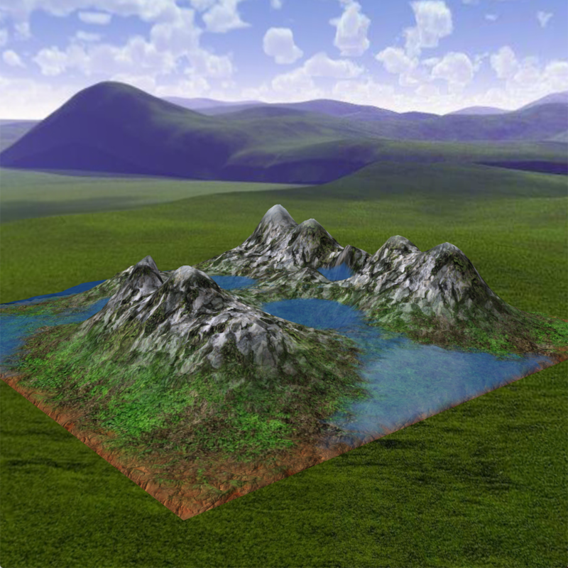
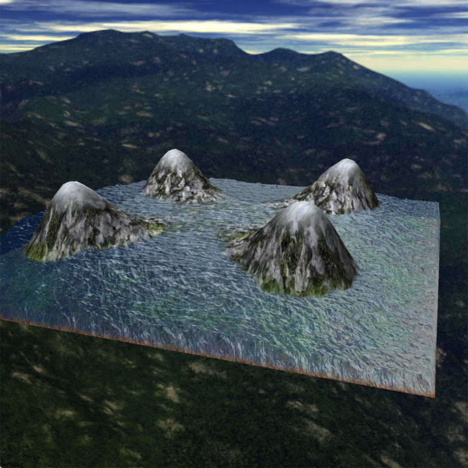
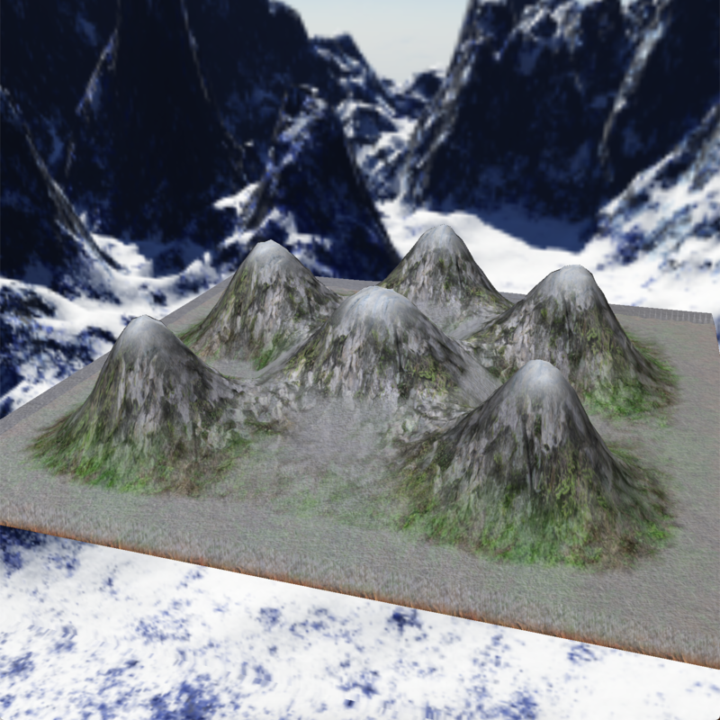

# Water on surface

This project is about water flow simulation on terrain


## Terrain modeling

Program gets external file as first parameter that contains terrain map (map/demoX.mod). It is a series of coordinates in 3D. They define a few sparse points through which surface will imperatively go across. It can be either 2, 10 or 20 points for example (not more than 50).
```
map/demo2: (10000,10000,6000) (15000,10000,100) (15000,15000,4000)
```
[IDW interpolation algoritm](https://gisgeography.com/inverse-distance-weighting-idw-interpolation/) is used to represent a surface that goes through those points.


## Water modeling

Height field based water simulation using ["pipe model"](https://docplayer.net/20844600-Real-time-fluid-simulation-using-height-fields.html)
The water is represented as a set of columns, water surface is described by the height of the columns.  Each column connected to 4 neighbors with "virtual pipes". 
Program gets as an second parameter an external file containing the initial map of water heights (map/waterXXX.mod)

## Basics

- C++11
- OpenGL 2.1
- GLSL 1.20

## Dependencies

- glfw 3.3.2
- glew 2.1.0
- glm 0.9.9.5
- sfml 2.5.1
- boost 1.72.0

## Install
```
git clone https://github.com/gitEllE-if/water_terrain_simulation.git waterSim
cd waterSim
make
```
I only tested and run this simulation on MacOS (Mojave, HighSierra, Catalina)

## Usage
```
./mod surface_file [water_file]
```
example: `./mod map/demo1.mod map/water.mod`

- `[ENTER]` - start
- `[SPACE]` - stop
- `[ASDW, mouse]` - camera control
- `[1]` - water  `[2]` - rain  `[3]` - snow
- `[Z]` - sound  `[X]` - mute
- `[<]` - slow   `[>]` - fast
- `[-]` - leak   `[+]` - rise   `[0]` - none
- `[{, arrow]` - water leak at the border
- `[}, arrow]` - water rise at the border
- `[p]` - none water leak/rise at the border


***water***

***rain***

***snow***

